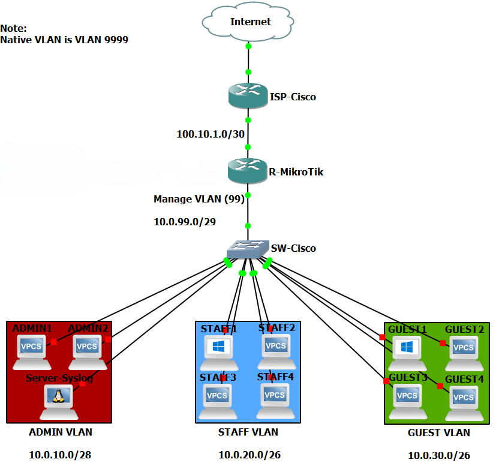

# 🔻پیاده‌سازی شبکه سازمانی کوچک - تمرکز بر امنیت
## 🔹محیط کار و توپولوژی


**GNS3**⬆️


## 🔹اهداف
* VLAN Segmentation
* Inter-VLAN Routing
* DHCP
* Firewall Policy
* Service Hardening
* Basic QoS (Simple Queue)
* Syslog
* Troubleshooting

## 🔸ترتیب اقدامات

1. **Addressing Plan**✅
	
2. **SW-Cisco**
    * VLANs✅
    * Trunk✅
    * Native VLAN✅
    * SSH Configuration✅
    * Port Security⚠️
	
3. **R-MikroTik**
    * VLAN Interfaces✅
    * IP Addressing✅
	* DHCP✅
	* Inter-VLAN Routing✅
	* NAT & Internet✅
	* Firewall✅
	* Service Hardening✅
	* Simple Queue✅
	
4. **Server-Syslog**✅
	
5. **Validation**✅


## 🔹اقدامات و کانفیگ‌ها
### 🔸فاز 1 (SW-Cisco)
>این فاز شامل کانفیگ‌های مربوط به **سوئیچ** سناریو میشه‼️


1. تعریف VLANها + Manage VLAN همراه Description⬇️
```Cisco-IOS
SW-Cisco(config)# vl 10
SW-Cisco(config-if)# name ADMIN
SW-Cisco(config-if)# vl 20
SW-Cisco(config-if)# name STAFFf
SW-Cisco(config-if)# vl 30
SW-Cisco(config-if)# name GUEST
SW-Cisco(config-if)# vl 99
SW-Cisco(config-if)# name MANAGE

SW-Cisco(config)# int vl 99
SW-Cisco(config-if)# ip addr 10.0.99.2 255.255.255.248
SW-Cisco(config-if)# ip default-gateway 10.0.99.1
SW-Cisco(config)# int vl 99
SW-Cisco(config-if)# descr Interface for ssh (Management)
SW-Cisco(config-if)# no sh
```


2. تعریف Default Route (برای ارتباطات بهتر و خطای کمتر)⬇️
```Cisco-IOS
SW-Cisco# conf t
Enter configuration commands, one per line.  End with CNTL/Z.
SW-Cisco(config)# ip route 0.0.0.0 0.0.0.0 10.0.99.1
SW-Cisco(config)# end
```


3. معرفی Access Portها همراه Description⬇️
```Cisco-IOS
SW-Cisco(config)# int ra g1/0-3
SW-Cisco(config-if-range)# descr VLAN 10 | ADMIN VLAN
SW-Cisco(config-if-range)# sw acc vl 10
SW-Cisco(config-if-range)# exit

SW-Cisco(config)# int ra g2/0-3
SW-Cisco(config-if-range)# descr VLAN 20 | STAFF VLAN
SW-Cisco(config-if-range)# sw acc vl 20
SW-Cisco(config-if-range)# exit

SW-Cisco(config)# int ra g3/0-3
SW-Cisco(config-if-range)# descr VLAN 30 | GUEST VLAN
SW-Cisco(config-if-range)# sw acc vl 30
```


4. تعریف Trunk Port و Native VLAN همراه Description⬇️
```Cisco-IOS
SW-Cisco(config)# int g0/0
SW-Cisco(config-if)# descr Trunk Port
SW-Cisco(config-if)# sw tr encap dot1q
SW-Cisco(config-if)# sw mo tr
SW-Cisco(config-if)# sw tr all vl 10,20,30,99
SW-Cisco(config-if)# sw tr native vl 999
```


5. پیاده‌سازی SSH⬇️
```Cisco-IOS
SW-Cisco(config)# en sec 123
SW-Cisco(config)# user omid privi 15 sec 321
SW-Cisco(config)# ip domain-name lab4.local
SW-Cisco(config)# cryp key gen rsa
The name for the keys will be: SW-Cisco.lab4.local
Choose the size of the key modulus in the range of 360 to 4096 for your
  General Purpose Keys. Choosing a key modulus greater than 512 may take
  a few minutes.

How many bits in the modulus [512]: 2048
% Generating 2048 bit RSA keys, keys will be non-exportable...
[OK] (elapsed time was 0 seconds)

*Jun 10 05:56:17.866: %SSH-5-ENABLED: SSH 1.99 has been enabled

SW-Cisco(config)#line vty 0 2
SW-Cisco(config-line)#login local
SW-Cisco(config-line)#login input ssh
                            ^
% Invalid input detected at '^' marker.
	
SW-Cisco(config-line)#transport input ssh
SW-Cisco(config-line)#exit
	
SW-Cisco(config)#ip ssh ver 2
SW-Cisco(config)#ip ssh time 60
SW-Cisco(config)#ip ssh auth 3
```


6. پیاده‌سازی Port Security⬇️
> توضیحات در بخش "مشکل"⚠️


7. تنظیم ارسال Logها به Server-Syslog⬇️
```Cisco-IOS
SW-Cisco(config)# service timestamps log datetime msec
SW-Cisco(config)# logging host 10.0.10.10
*Jun 29 03:50:22.443: %SYS-6-LOGGINGHOST_STARTSTOP: Logging to host 10.0.10.10 port 514 started - CLI initiated
SW-Cisco(config)# logging trap info
SW-Cisco(config)# loggin source vl 99
SW-Cisco(config)#end
```


### 🔸فاز 2 (R-MikroTik)
>این فاز شامل کانفیگ‌های مربوط به **روتر** سناریو میشه‼️


1. تعریف VLANها⬇️
![[R-MikroTik - VLANs.png]]


2. تنظیم IP Address⬇️
![[R-MikroTik - IP Addresses.png]]


3. راه‌اندازی DHCP + دادن Reserved IP به Server-Syslog⬇️
![[R-MikroTik - DHCP.png]]


4. تنظیم NAT و Default Route⬇️
![[R-MikroTik - NAT+Route.png]]


5. نوشتن Ruleهای Firewall⬇️
![[R-MikroTik - Firewall.png]]
>**نکته**:
>حین نوشتن این Ruleها خیلی از ChatGPT راجب **اصول** Rule نویسی سوال کردم و چیزای خوبی فهمیدم‼️


6. بستن IP Serviceها⬇️
![[R-MikroTik - IP Services.png]]


7. تعریف Simple Queue⬇️
![[R-MikroTik - Simple Queue.png]]


8. تعریف`Rule`و`Action`برای ارسال Logها به`10.0.10.10`⬇️
![[R-MikroTik - Logging.png]]


### 🔸فاز 3 (Server-Syslog)
>این فاز شامل کانفیگ‌های مربوط به **سرور لینوکس** سناریو میشه‼️


1. تنظیم Static IP روی Server-Lubuntu⬇️
```sh
$ sudo vi /etc/netplan/01-network-manager-all.yaml
```
![[Server-Syslog - netplan.png]]
>**نکته**:
>من خط`dhcp4: no`رو ننوشتم؛ در اینجا فرقی هم نمیکنه، چون IP که DHCP قراره بده `10.0.10.10`عه‼️


2. باز کردن`UDP Port 514`با اضافه کردن این 2 خط به آخر`rsyslog.conf`⬇️
```sh
$ sudo vi /etc/rsyslog.conf
.
..
...
module(load="imudp")
input(type="imudp" port="514")
```


3. ساخت فایل کانفیگ در`rsyslog.d`و نوشتن Rule برای جداسازی Logها⬇️
```sh
$ sudo vi /etc/rsyslog.d/10-network-devices.conf
```
![[Server-Syslog - rsyslog.d.png]]
>**نکته**:
>سر نوشتن این دو Rule هم از **ChatGPT** کمک گرفتم و با بررسی، فهمیدیم که سیسکو Logها رو با **IP** و میکروتیک با **Hostname** ارسال میکنه‼️


4. ری‌استارت سرویس`rsyslog` و بررسی وضعیت⬇️
```sh
$ sudo systemctl restart rsyslog
$ sudo systemctl status rsyslog
```


5. بررسی باز بودن`UDP Port 514`⬇️
![[Server-Syslog - ss.png]]


## 🔹راستی آزمایی
### 🔸فاز 4 (Validation)
>این فاز برای بررسی نهایی و **پایان** کل سناریو عه‼️


* صحت اختصاص VLANها و کانفیگ Trunk⬇️✅
![[Validation - VLAN & Trunk.png]]


* صحت عملکرد Inter-VLAN Routing⬇️✅
![[Validation - Inter-VLAN Routing.png]]
>**نکته**:
>اینجا مجبور بودم Ruleهای Firewall رو **غیرفعال** کنم؛ چون عملا یکی از سیاست‌های **اصلی**مون دسترسی نداشتن به`ADMIN`بود‼️


* صحت کانفیگ SSH و دسترسی به سوئیچ⬇️✅
![[Validation - SSH.png]]
>**نکته**:
>نوشتن یه همچین دستور طولانی/دقیق صرفا بخاطر **قدیمی** بودن`IOS`روی سوئیچ بود‼️


* صحت اتصال به اینترنت و کارکرد NAT⬇️✅
![[Validation - Internet & NAT.png]]


* صحت عملکرد سیاست‌های Firewall طبق انتظار⬇️✅
![[Validation - Firewall.png]]
>ناتوانی دسترسی`GUEST`به`Internal` | ناتوانی دسترسی`STAFF`به غیر از خودش | ناتوانی‌شون در`ssh`.


* صحت عملکرد Syslog Server؛ دریافت Logها از Cisco و MikroTik⬇️✅
![[Validation - Rsyslog.png]]


## 🔹مشکل
- **مشکل**م در بخش Port Security بود؛ به دلیل **باگ** داخل نسخه Image، سوئیچ`Administrative Mode`پورت‌ها رو **بعد از** دستور`switchport mode access` از`dynamic desirable`به`static access`تغییر نمیداد؛ پس دستور`switchport port-security`با **Reject** مواجه میشد🛑
    
- **راه‌حل**‌ش کلی صحبت با **ChatGPT** و آزمایش داخل`IOS`بود؛ اما نهایتا پی بردیم که عملا راه‌حل **نداره** و باید به عنوان باگ نسخه "*(vIOS-L2 (15.0(TTC_20140605*" قبولش کنیم‼️


## 🔹نتیجه
> سناریو درکل موفقیت‌آمیز بود✅️
    
* همراه با کلی تجربه جدید!
